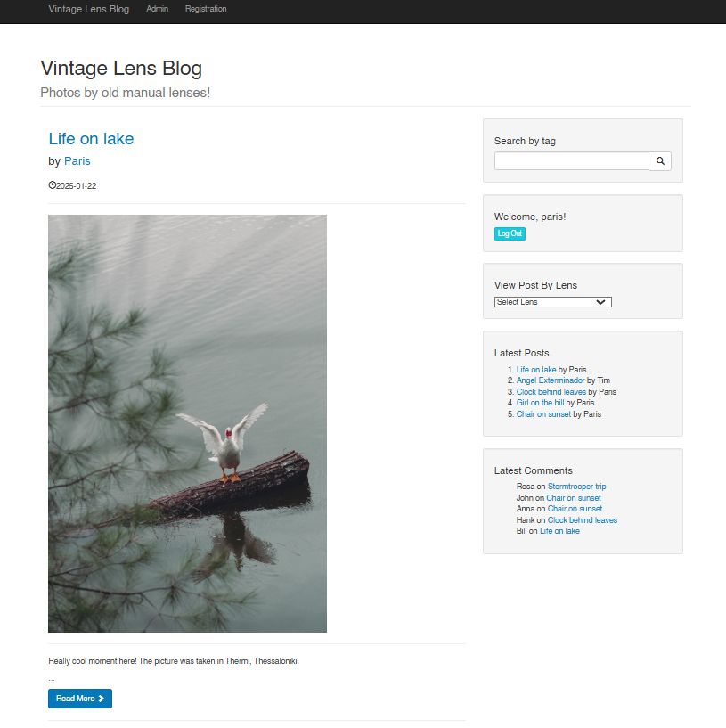
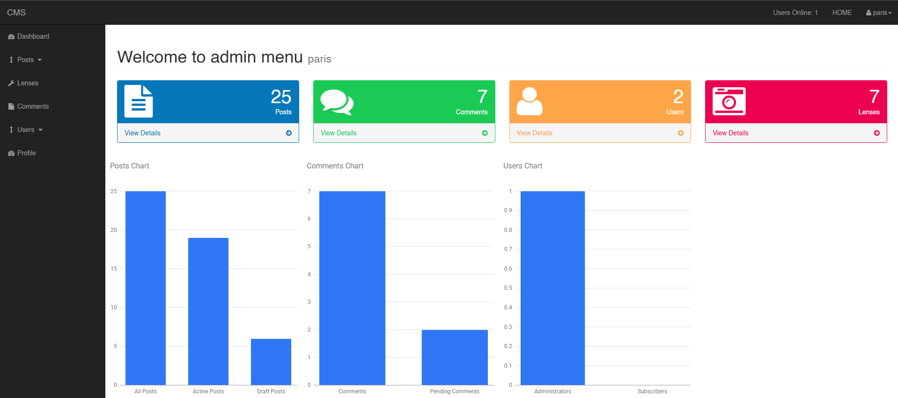

# 📸 Lens Gallery CMS

## 🗙️ Overview
Lens Gallery CMS is a PHP-based content management system tailored for photographers passionate about vintage lenses. This platform enables users to upload and categorize photographs based on the lenses used. The primary administrator can manage the gallery and grant trusted subscribers the ability to contribute their own images.

## 📸 Screenshots

  
  

## 🚀 Features
- **Photo Uploads**: Easily upload images and associate them with specific lenses.
- **Categorization**: Organize photos by lens type for streamlined browsing.
- **User Management**: Administrators can manage subscribers and control access.
- **Subscriber Contributions**: Trusted users can upload and manage their own photos.
- **Responsive Design**: Optimized for various devices to ensure a seamless user experience.
- **Database Initialization**: Includes a database setup file at sql/schema.sql for easy installation

## 📌 Usage
1. **Administrator**:
    - Log in to access the admin dashboard.
    - Manage users, lenses, and photo categories.
    - Review and approve photos uploaded by subscribers.
2. **Subscribers**:
    - Register and log in to your account.
    - Upload photos and tag them with the appropriate lens.
    - View and manage your uploaded photos.

## ❗ Known Issues
- **Limited Search Functionality**: Currently, the search feature is basic and may not return comprehensive results.
    - 🔹 An enhanced search functionality is planned for a future update.
- **Image Upload Size Limit**: There is a restriction on the size of images that can be uploaded.
    - 🔹 Future versions will include support for larger image uploads and automatic resizing.

---

